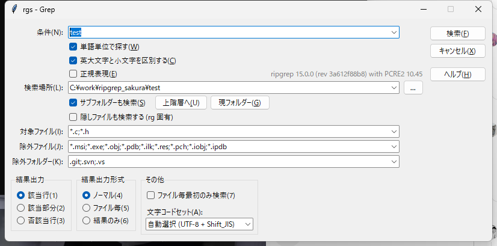

# rgs — ripgrep の結果をサクラエディタで開く

[ripgrep](https://github.com/BurntSushi/ripgrep) で検索し、その結果を
**サクラエディタの Grep 結果形式**（`ファイル名(行,桁): 内容`）に変換してサクラエディタで開く。
結果行で `F12`（タグジャンプ）を押すと、その行のファイル・行・桁へ飛べる。

サクラエディタ内蔵の Grep を ripgrep に置き換えて、大きなツリーでも待たずに検索するのが目的。



## できること

- ripgrep の速度で検索して、結果をサクラエディタの Grep 結果として開く
- 結果行から `F12` でタグジャンプ、`Shift+F12` で戻る。Ctrl+ダブルクリックで飛ぶ設定にもできる
- サクラエディタの Grep ダイアログに合わせた検索ダイアログ
  （対象／除外ファイル、除外フォルダー、正規表現、結果出力形式、文字コードセット）
- **サクラエディタと同じ単語単位検索** — `test` が `test用` にマッチする
  （ripgrep の `-w` は Unicode の単語境界なのでマッチしない）
- **日本語の桁ずれなし** — ripgrep のバイト単位の桁をサクラエディタの文字単位の桁へ変換
- **Shift_JIS と UTF-8 が混在したツリー**も検索できる（2 回検索して重複を除く）
- サクラエディタのマクロから起動（カーソル位置の単語と編集中フォルダーを初期値にする）

Python 版と PowerShell 版があり、**どちらも同じ仕様**（[docs/spec.md](docs/spec.md)）で同じ出力を返す。
通常は Python 版を使えばよい。

## 動作環境

| | |
|---|---|
| OS | Windows |
| サクラエディタ | 2.4 系で確認（2.4.3.7173） |
| ripgrep | 14 以降。単語単位検索には PCRE2 入りのビルドが必要 |
| Python | 3.8 以降（Python 版を使う場合。標準の `tkinter` を使う） |

PowerShell 版は Windows 標準の PowerShell 5.1 で動くので、Python が無くても使える。

## インストール

```
git clone https://github.com/sh0066aaaa/ripgrep_sakura.git
```

ripgrep が入っていなければ:

```
winget install BurntSushi.ripgrep.MSVC
```

`python`（または `powershell`）フォルダを PATH に追加すると、どこからでも `rgs` で呼べる。
サクラエディタから使う場合の設定は「[サクラエディタから起動する（マクロ）](#サクラエディタから起動するマクロ)」を参照。

## 構成

```
ripgrep_sakura/
├─ rgrc                  ripgrep の既定オプション（両実装で共有）
├─ docs/
│  ├─ spec.md            仕様（実装非依存）
│  └─ sakura-notes.md    サクラエディタ側の調査メモ
├─ python/
│  ├─ rgs.py             Python 実装（推奨）
│  ├─ rgs.cmd            cmd.exe / Win+R 用ラッパー
│  └─ test_rgs.py        単体テスト
├─ powershell/
│  ├─ rgs.ps1            PowerShell 実装
│  └─ rgs.cmd            cmd.exe / Win+R 用ラッパー
└─ macros/
   ├─ rgs.vbs            サクラエディタ用マクロ（検索ダイアログを開く）
   └─ rgs_quick.vbs      サクラエディタ用マクロ（即検索してアウトプットウィンドウへ）
```

## 使い方

```
rgs TODO                      # カレント配下を検索
rgs -i "foo bar" src          # rg のオプションはそのまま渡せる
rgs -g "*.cs" -w Hoge
rgs -Dialog                   # 検索ダイアログを開く
rgs -WordJp test              # サクラエディタと同じ単語単位で検索
rgs -Direct MainWindow        # 先頭ヒットのファイルを直接その行で開く
rgs -DryRun -i -w foo         # rg に渡す引数を表示するだけ（確認用）
```

制御スイッチ（`-Dialog` `-Direct` `-Stdout` `-DryRun` `-WordJp`）は**先頭**に置く。
それ以外の引数はすべて rg にそのまま渡る。

| キー | 動作 |
|---|---|
| `F12` | タグジャンプ（カーソル行のファイル・行・桁へ移動） |
| `Shift+F12` | タグジャンプバック（結果一覧に戻る） |

## 検索ダイアログ

`rgs -Dialog` で、**サクラエディタの Grep ダイアログに合わせた画面**が出る（Python 版）。

| 項目 | 渡される rg オプション |
|---|---|
| 条件(N) | パターン（履歴付きコンボ） |
| 単語単位で探す(W) | サクラエディタ互換の文字種境界（後述） |
| 英大文字と小文字を区別する(C) | ON `-s` / OFF `-i` |
| 正規表現(E) | OFF のとき `-F` |
| 検索場所(L) | 検索パス（`...` で参照、`上階層へ` `現フォルダー` ボタン付き） |
| サブフォルダーも検索(S) | OFF のとき `--max-depth=1` |
| 隠しファイルも検索する | `--hidden`（rg 固有。サクラエディタには無い項目） |
| 対象ファイル(I) | `-g *.c -g *.h`（空欄と `*.*` は「すべて」の意味） |
| 除外ファイル(J) | `-g !*.exe` … |
| 除外フォルダー(K) | `-g !.git/**` … |
| 結果出力 | 該当行=既定 / 該当部分=`-o` / 否該当行=`-v` |
| 結果出力形式 | ノーマル / ファイル毎 / 結果のみ |
| ファイル毎最初のみ検索(7) | `-m 1` |
| 文字コードセット(A) | `--encoding`（後述） |

`Enter` または `Alt+F` で検索、`Esc` または `Alt+X` でキャンセル。
チェックボックスとボタンには `Alt` のアクセラレータを割り当ててある。

入力内容と履歴は `%APPDATA%\rgs\dialog.json` に保存され、次回復元される。

### 結果出力形式とタグジャンプ

| 形式 | 出力 | タグジャンプ |
|---|---|---|
| ノーマル | `C:\path\file.c(12,5): 内容` | できる |
| ファイル毎 | ファイル名の行に続けて `(12,5): 内容` | できない |
| 結果のみ | マッチした行の内容だけ | できない |

ノーマル以外は行にファイル名が無いため、F12 の対象にならない。

### 文字コードセット

rg はサクラエディタのような 1 ファイルごとの文字コード判定ができず、
`--encoding` を指定するとすべてのファイルをその文字コードとして読む。

そこで既定の **「自動選択 (UTF-8 + Shift_JIS)」** では、UTF-8 と Shift_JIS で 2 回検索する。
単純に足すと ASCII の検索語で同じ箇所が二重に出るので、ファイルの中身を見て
UTF-8 として読めるかどうかで、どちらの回の結果を採用するかをファイルごとに決めている。

### サクラエディタにあって実装していない項目

| 項目 | 理由 |
|---|---|
| 編集中のテキストから検索(M) | 外部プロセスなのでエディタのバッファを参照できない |
| カレントフォルダーが初期値(D) | フォルダーは常にマクロから渡すため不要 |
| フォルダー毎に表示(8) / ベースフォルダー表示(9) | タグジャンプできない形式が増えるだけなので省略 |
| CP | rg に対応する指定が無い |

PowerShell 版のダイアログは項目を絞った簡易版のまま。

## サクラエディタから起動する（マクロ）

### 登録手順

1. **設定 → 共通設定 → マクロ**
   - 「マクロ一覧」のフォルダに `<clone したフォルダ>\macros` を指定
   - 空き番号に 名前 `rgs` / File `rgs.vbs`（必要なら `rgs_quick.vbs` も別番号に）
2. **設定 → キー割り当て**
   - 種別「外部マクロ」→ `rgs` を選び、好きなキー（例 `Ctrl+Shift+G`）に割り当て

### 2 つのマクロ

| マクロ | 動作 | 結果の出力先 |
|---|---|---|
| `rgs.vbs` | 検索ダイアログを開く（非同期なのでサクラエディタは固まらない） | 新しいタブ |
| `rgs_quick.vbs` | 入力ボックスで確認したら即検索 | アウトプットウィンドウ |

どちらもカーソル位置の単語（または選択範囲）と、編集中ファイルのフォルダを初期値にする。

### 実装の切り替え

各マクロの先頭にある定数を書き換えるだけ。

```vbs
' 使う実装: "python" または "powershell"
Const IMPL = "python"
```

マクロは自身のパス（`$M`）からリポジトリの場所を求めるので、
フォルダごと移動しても書き換えは不要（求まらないときは `ROOT_FALLBACK` を使う）。

## クリックでジャンプする

サクラエディタはマウス操作にも機能を割り当てられる。
既定では `ダブルクリック` は「現在位置の単語選択」に割り当てられている。

**Ctrl+ダブルクリック に「タグジャンプ」を割り当てるのがおすすめ**。
通常のダブルクリック（単語選択）を残したまま、結果行を Ctrl+ダブルクリックで飛べる。

### 設定手順

1. **設定 → 共通設定 → キー割り当て**
2. 「キー」の一覧から **`ダブルクリック`** を選ぶ
3. `Shift` `Ctrl` `Alt` のチェックのうち **`Ctrl` だけを ON** にする
4. 「機能の種別」を **検索**、「機能」から **タグジャンプ** を選ぶ
5. **[割り当て]** → **OK**

ダブルクリックそのものに割り当てることもできるが、
単語選択が使えなくなるので注意（この設定は結果ウィンドウだけでなく全ファイルに効く）。

### 設定ファイルを直接書き換える場合

`%APPDATA%\sakura\sakura.ini` の `[KeyBind]` セクションにある。

```
KeyBind[000]=0100,30400,30400,30400,30400,30400,30400,30400,30400,ダブルクリック
```

数字は左からキーコードと、修飾キーの組み合わせ 8 通りに対応する機能 ID。

| 位置 | 修飾キー |
|---|---|
| 1 | なし |
| 2 | Shift |
| 3 | **Ctrl** |
| 4 | Shift+Ctrl |
| 5〜8 | Alt との組み合わせ |

`30400` = 現在位置の単語選択、`30940` = タグジャンプ、`30941` = タグジャンプバック。
Ctrl+ダブルクリックをタグジャンプにするなら 3 番目を `30940` にする。

```
KeyBind[000]=0100,30400,30400,30940,30400,30400,30400,30400,30400,ダブルクリック
```

**サクラエディタを完全に終了してから書き換えること。**
起動中に書き換えても、終了時に上書きされて元に戻る。

### 右クリックメニューに追加する方法

キー割り当てを変えたくない場合は、
**設定 → 共通設定 → カスタムメニュー** で「右クリックメニュー」に「タグジャンプ」を追加すると、
右クリック → タグジャンプ で飛べる。既存の操作を潰さずに済む。

## 単語単位検索の違いについて

ripgrep の `-w` とサクラエディタの「単語単位」は**単語境界の定義が違う**。

| | 単語構成文字の考え方 | `test` で `test用` は |
|---|---|---|
| ripgrep `-w` | Unicode の単語境界。漢字・かなも単語構成文字 | **マッチしない** |
| サクラエディタ | 文字種（英数字／ひらがな／カタカナ／漢字）の変わり目が区切り | マッチする |

`-WordJp` とダイアログの「単語単位で探す」は**サクラエディタ側の挙動**に合わせてある。
検索語の先頭・末尾の文字種だけを禁止する先読み・後読みを組み立てて PCRE2（`-P`）で検索する。

```
test  ->  (?<![0-9A-Za-z_])test(?![0-9A-Za-z_])
```

実際の挙動（検索語 `test`）:

| 対象 | `-w` | `-WordJp` |
|---|---|---|
| `test用のコード` | ✗ | ✓ |
| `これはtestです` | ✗ | ✓ |
| `テスト用のtest` | ✗ | ✓ |
| `unit test done` | ✓ | ✓ |
| `testing here` | ✗ | ✗ |
| `a_test_b` | ✗ | ✗ |
| `contest用` | ✗ | ✗ |

日本語の検索語でも同じ考え方で動く（検索語 `用`）:

| 対象 | 結果 |
|---|---|
| `test用のコード` | ✓（前が英数字） |
| `テスト用です` | ✓（前がカタカナ） |
| `この用でいい` | ✓（前後がひらがな） |
| `試用中のもの` | ✗（前が漢字） |
| `用途を確認` | ✗（後ろが漢字） |

正規表現と併用したとき、および rg が PCRE2 無しビルドのときは `-w` にフォールバックする。

## 既定オプション

毎回付けたいオプションは ripgrep 本体の設定ファイル機能で指定する。
リポジトリ直下の `rgrc` がそれで、`RIPGREP_CONFIG_PATH` が未設定なら自動で使われる。

```
# 1 行 1 引数。値を取るものは --opt=value の形（スペース区切り不可）
--smart-case
--max-columns=500
--glob=!node_modules/*
```

コマンドラインやダイアログの指定のほうが優先される。

## 環境変数

| 変数 | 用途 |
|---|---|
| `SAKURA_EXE` | sakura.exe のパス（未設定なら Program Files 等を自動探索） |
| `RG_EXE` | rg.exe のパス（未設定なら PATH → VS Code 同梱を自動探索） |
| `RIPGREP_CONFIG_PATH` | rg の設定ファイル（未設定なら `rgrc`） |

## 仕様・調査メモ

- [docs/spec.md](docs/spec.md) — 実装非依存の仕様
- [docs/sakura-notes.md](docs/sakura-notes.md) — サクラエディタのヘルプから確認した内容

## ライセンス

MIT License — [LICENSE](LICENSE)

## English summary

`rgs` runs [ripgrep](https://github.com/BurntSushi/ripgrep) and opens the results in
[Sakura Editor](https://sakura-editor.github.io/) formatted as a Grep result list,
so `F12` (tag jump) takes you straight to the match.

It adds a search dialog modelled on Sakura's own Grep dialog, converts ripgrep's
byte-based column numbers to the character-based columns Sakura expects (so lines
containing Japanese text jump to the right position), and reproduces Sakura's
character-class word boundaries — `test` matches inside `test用`, which ripgrep's
`-w` does not.

Windows only. Python and PowerShell implementations are provided; both follow the
same specification and produce the same output. Documentation is in Japanese.
